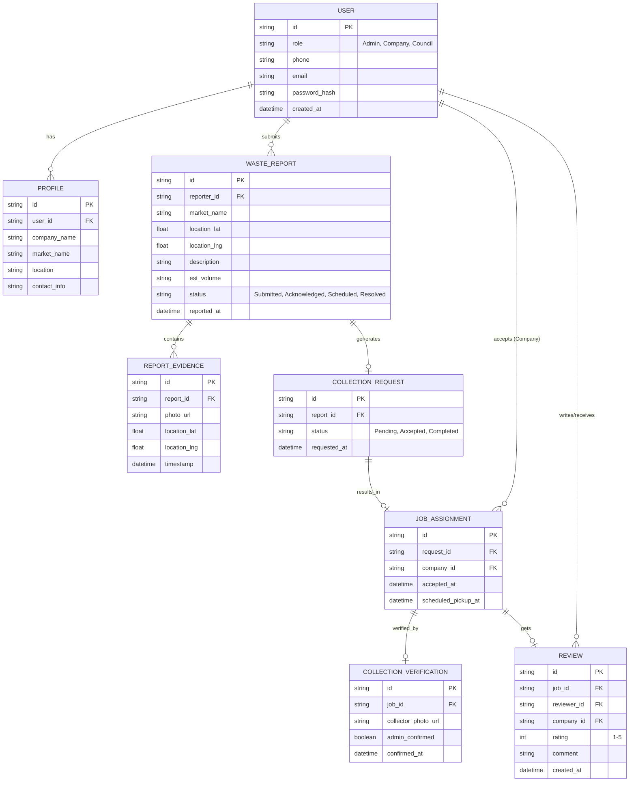

# Tiklina Waste Management App Design

This document outlines the Database Schema (ERD) and UI Screens/User Flows for the Tiklina Waste Management App based on the SRD provided.

## User Review Required
Please review the proposed database schema and user flows to ensure they meet your requirements before we proceed with the actual implementation.

## Database Schema (ERD)
The backend requires a robust data model to support users, waste reports, evidence, marketplace requests, and reviews. 

## UI Screens

### 1. Onboarding & Authentication
*   **Splash Screen**: App logo (Tiklina).
*   **User Selection Screen**: "I am a Market Admin" vs "I am a Waste Collector".
*   **Login / OTP Verification**: Phone number entry, OTP confirmation.
*   **Profile Setup**: 
    *   *Admins*: Register Market name, Location.
    *   *Companies*: Register Company name, Service area.

### 2. Market Administrator Flow
*   **Admin Dashboard (Home)**: 
    *   Overview of active complaints (Pending, Scheduled, Resolved).
    *   Large "Report Waste" FAB (Floating Action Button).
*   **Report Waste (Multi-step Form)**:
    *   *Step 1*: Capture Photos (Camera integration).
    *   *Step 2*: Auto-capture GPS mapping.
    *   *Step 3*: Form fields (Description, Estimated volume).
    *   *Step 4*: Submit to Council. Option for "Request Private Collection".
*   **Complaint Details / Tracking**: Timeline of the report status.
*   **Verification Screen**: Form to confirm pickup & rate the company (1-5 stars).

### 3. Waste Collector Company Flow
*   **Company Dashboard (Home)**: 
    *   Map / List of available collection requests in their service area.
    *   Ongoing Jobs tab.
*   **Job Details**: View market name, waste volume, photos, and exact map location. Buttons to "Accept Job" or "Decline".
*   **Job Execution**: 
    *   Upload "After Collection" photo proof.
    *   Mark as "Completed".
*   **Company Profile & Ratings**: Showing their overall rating and reviews from market admins.

## User Flow
1. **Reporting**: Admin logs in -> Taps Report -> Takes Photo -> Submits -> Council notified.
2. **Escalation**: If Council ignores -> Admin requests Private -> Request added to Marketplace.
3. **Fulfillment**: Company sees request -> Accepts -> Travels to location -> Collects Waste -> Uploads Photo -> Marks Complete.
4. **Closure**: Admin gets notification -> Confirms collection -> Rates Company -> Job closed.
